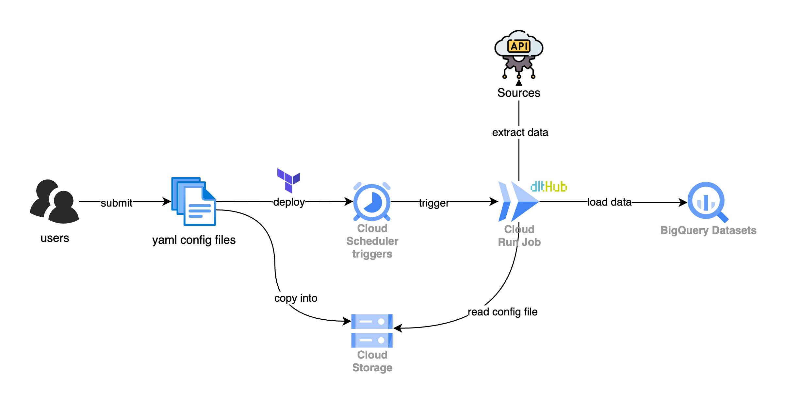

# serverless-dlt-hub

**serverless-dlt-hub** is a framework for orchestrating serverless data ingestion pipelines on Google Cloud Platform (GCP). It integrates dltHub for data loading, Google Cloud Run for serverless execution, and Terraform for infrastructure provisioning. The project enables configuration-driven pipeline deployments, supporting ingestion from diverse sources into BigQuery, with all pipeline configurations managed in a Google Cloud Storage (GCS) bucket.



## Why dltHub?

dltHub is a modern open-source data loading framework designed for simplicity, scalability, and flexibility. It enables users to ingest data from various sources—including APIs, databases, and files—into cloud data warehouses with minimal code. Key advantages include:

- **Declarative Configuration:** Easily define data sources and destinations using YAML or Python, reducing boilerplate and manual coding.
- **Extensible Ecosystem:** Offers numerous built-in connectors for diverse data sources and destinations, including support for complex REST API configurations.
- **Efficient Data Loading:** Handles schema inference/validation, automatic checkpointing, incremental loading, and automatic type conversion, streamlining ETL workflows.
- **Cloud-Native Design:** Optimized for serverless and cloud environments, making it ideal for scalable, automated data pipelines.

## Key Features

- Serverless data ingestion using Cloud Run jobs
- Configurable pipelines via YAML files stored in GCS
- Automated infrastructure provisioning with Terraform
- Example deployment and usage instructions provided
- Designed for teams seeking to automate and scale data ingestion workflows on GCP with minimal operational overhead

## Requirements

- `uv` for Python package management
- `terraform` for deploying GCP infrastructure dependencies
- Enabled GCP APIs: Artifact Registry, Cloud Scheduler, Cloud Run, Cloud Storage, and BigQuery
- A dedicated GCP service account for this project
- The following IAM roles must be assigned to the service account:
  - BigQuery Data Editor
  - BigQuery Job User
  - BigQuery Read Session User
  - Cloud Run Jobs Executor with overrides
  - Cloud Scheduler Job Runner
  - Logs Writer
  - Storage Bucket Viewer
  - Storage Object Viewer
- An Artifact Registry for Docker images

## Example: Deploying Data Ingestion Pipelines

This example demonstrates how to ingest data from an external [Pokémon API](https://pokeapi.co/docs/v2) (specifically the "pokemon" and "berry" endpoints) into BigQuery. The configuration file specifies the pipeline schedule, data source, and destination settings.

Source and destination configurations abstract dltHub's Python code, allowing straightforward specification of REST API endpoints and BigQuery tables.

- [REST API Source Documentation](https://dlthub.com/docs/dlt-ecosystem/verified-sources/rest_api/basic)
- [BigQuery Destination Documentation](https://dlthub.com/docs/dlt-ecosystem/verified-sources/rest_api/basic)

The framework is easily extensible to support additional data sources and destinations.

Create or update a `.env` file with the required environment variables for your deployment:

```bash
source .env
```

Build and deploy the Cloud Run job:

```bash
cd cloud_run_job

# Build the Docker image for Cloud Run (specify platform for compatibility)
docker build --platform linux/amd64 -t ${REGION}-docker.pkg.dev/${GCP_PROJECT_ID}/${GCP_ARTIFACT_REGISTRY}/${CR_JOB_NAME} .

# Push the Docker image to Artifact Registry
docker push ${REGION}-docker.pkg.dev/${GCP_PROJECT_ID}/${GCP_ARTIFACT_REGISTRY}/${CR_JOB_NAME}

# Deploy the Cloud Run job using the pushed image and set required parameters
gcloud run jobs deploy ${CR_JOB_NAME} \
    --image=${REGION}-docker.pkg.dev/${GCP_PROJECT_ID}/${GCP_ARTIFACT_REGISTRY}/${CR_JOB_NAME}:latest \
    --region=${REGION} \
    --project=${GCP_PROJECT_ID} \
    --max-retries=0 \
    --task-timeout=120s \
    --service-account=${GCP_SERVICE_ACCOUNT} \
    --cpu=1 \
    --memory=512Mi \
    --set-env-vars=LOCATION=${LOCATION},GCS_BUCKET_NAME=${GCS_BUCKET_NAME}
```

Provision infrastructure using Terraform:

```bash

cd pipeline_schedulers

terraform init

terraform plan # Creates GCS bucket and Cloud Schedulers

terraform apply -auto-approve

```

Upload all pipeline configuration YAML files to the GCS bucket:

```bash
gsutil -m cp configs/* gs://${GCS_BUCKET_NAME}/
```

Trigger the Cloud Scheduler via the GCP Console UI.  
Verify in BigQuery that the dataset and tables (`berry` and `pokemon`) are created successfully.

## Areas for Further Improvement

- **Enhanced Schema and Data Contract Validation:** Leverage dltHub’s built-in schema and data contract validation features for more robust data quality assurance. [Learn more](https://dlthub.com/docs/general-usage/schema-contracts)
- **Improved Job Identification:** Develop a more descriptive and consistent naming convention for Cloud Run job executions to simplify monitoring and troubleshooting.
- **Flexible Parameter Overrides:** Currently, overriding the `CONFIG_FILE` variable enables dynamic data ingestion, but complicates ad hoc retries. Consider supporting parameter-level overrides in addition to file-based overrides to streamline ad hoc executions.

## References

- [dltHub Documentation](https://dlthub.com/docs/intro)
- [Google Cloud Platform Documentation](https://cloud.google.com/docs)
- [Terraform Documentation](https://developer.hashicorp.com/terraform/docs)